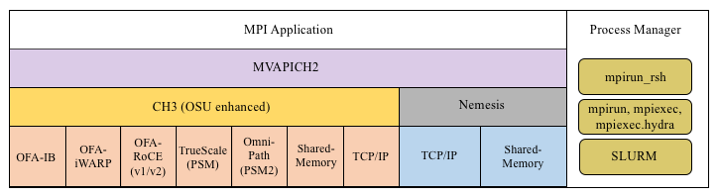

=========================
MVAPICH2 2.3.7 User Guide
=========================

    :Author: MVAPICH Team

    :Organization: | Network-Based Computing Laboratory
                   | Department of Computer Science and Engineering

    :Address: The Ohio State University

    :Contact: http://mvapich.cse.ohio-state.edu

    :Copyright: | Copyright (c) 2001-2022
                | Network-Based Computing Laboratory,
                | headed by Dr. D. K. Panda.
                | All rights reserved.
    :Date: Last revised: July 30th, 2024

.. contents::

1 Overview of the MVAPICH Project
---------------------------------

InfiniBand, Omni-Path, Ethernet/iWARP RDMA over
Converged Ethernet (RoCE), Slingshot 10, and Rockport Networks are
high-performance networking technologies to deliver low latency and
high bandwidth.  They are also achieving widespread acceptance due to their
*open standards*.

MVAPICH (pronounced as \`\`em-vah-pich'') is an *open-source* MPI software to
exploit the novel features and mechanisms of these networking technologies and
deliver best performance and scalability to MPI applications.  This software is
developed in the `Network-Based Computing Laboratory (NBCL) <http://nowlab.cse.ohio-state.edu>`_, headed by
`Prof. Dhabaleswar K. (DK) Panda <http://www.cse.ohio-state.edu/~panda>`_.

The MVAPICH2 MPI library supports MPI-3 semantics.  This *open-source* MPI
software project started in 2001 and a first high-performance implementation was
demonstrated at SuperComputing '02 conference.  After that, this software has
been steadily gaining acceptance in the HPC, InfiniBand, Omni-Path,
Ethernet/iWARP and
RoCE communities. As of  March 2022, more than 3,200
organizations (National Labs, Universities and Industry) world-wide (in 89
countries) have registered as MVAPICH users at MVAPICH project web site. There
have also been more than 1.56 million downloads of this
software from the MVAPICH
project site directly.  In addition, many InfiniBand, Omni-Path, Ethernet/iWARP
and
RoCE vendors, server vendors, systems integrators and Linux distributors have
been incorporating MVAPICH2 into their software stacks and distributing it.
MVAPICH2 distribution is available under BSD licensing.

Several InfiniBand systems using MVAPICH2 have obtained positions in
the TOP 500
ranking.  The Nov '21 list includes the following systems:

- 4th, 10,649,600-core (Sunway TaihuLight) at National Supercomputing Center in Wuxi, China;

- 13th, 448,448 cores (Frontera) at TACC;

- 26th, 391,680 cores (ABCI) in Japan;

- 38st, 570,020 cores (Neurion) in South Korea;

- 39nd, 556,104 cores (Oakforest-PACS) in Japan;

- 44th, 367,024 cores (Stampede2) at TACC.

More details on MVAPICH software, users list, mailing lists, sample performance
numbers on a wide range of platforms and interconnects, a set of OSU benchmarks,
related publications, and other InfiniBand-, RoCE, Omni-Path, and iWARP-related projects (High-Performance Big Data and High-Performance Deep Learning)
can be obtained from our
website:`http://mvapich.cse.ohio-state.edu <http://mvapich.cse.ohio-state.edu>`_.

This document contains necessary information for MVAPICH2 users to download,
install, test, use, tune and troubleshoot MVAPICH2 2.3.7.  We
continuously fix bugs and update update this document as per user feedback.
Therefore, we strongly encourage you to refer to our web page for updates.

2 How to use this User Guide?
-----------------------------

This guide is designed to take the user through all the steps involved in
configuring, installing, running and tuning MPI applications over InfiniBand
using MVAPICH2 2.3.7.

In Section `sec:features`_ we describe all the features in MVAPICH2
\mvapichversion. As you read through this section, please note our new features
(**NEW**) compared to version \mvapicholdversion.
Some of these features are designed in order to optimize specific type of MPI
applications and achieve greater scalability.  Section `sec:install`_
describes in detail the configuration and installation steps.  This section
enables the user to identify specific compilation flags which can be used to
turn some of the features on or off.  Basic usage of MVAPICH2 is explained in
Section `sec:usage`_. Section `sec:advanced_usage`_ provides instructions
for running MVAPICH2 with some of the advanced features.
Section `sec:osubenchmarks`_ describes the usage of the OSU Benchmarks.
In Section `sec:performance-tuning`_ we suggest some tuning techniques
for multi-thousand node clusters using some of our new features.  If you
have any problems using MVAPICH2, please check
Section `sec:troubleshooting`_ where we list some of the common
problems people face.  Finally, in Sections `def:mvapich-parameters`_
and `def:mvapich-parameters-nem`_, we list all important run time
parameters, their default values and a short description.

.. _sec:features:

3 MVAPICH2 2.3.7  Features
--------------------------

MVAPICH2 (MPI-3 over InfiniBand) is an MPI-3 implementation based on
`MPICH <http://www.mpich.org/>`_ ADI3 layer.  MVAPICH2 \mvapichversion is
available as a single integrated package (with MPICH \mpichversion).  The
current release supports ten different underlying transport interfaces, as shown
in Figure `fig:modules`_.

    Overview of different available interfaces of the MVAPICH2 library

- OFA-IB-CH3: This interface supports all InfiniBand compliant devices based on the `OpenFabrics <http://www.openfabrics.org>`_ layer. This interface has the most features and is most widely used. For example, this interface can be used over all Mellanox InfiniBand adapters, IBM eHCA adapters and TrueScale adapters.

- OFA-iWARP-CH3: This interface supports all iWARP compliant devices supported by OpenFabrics. For example, this layer supports Chelsio T3 adapters with the native iWARP mode.

- OFA-RoCE-CH3: This interface supports the emerging RoCE (RDMA over Converged Ethernet) interface for Mellanox ConnectX-EN adapters with 10/40GigE switches. It provides support for RoCE v1 and v2.

- TrueScale (PSM-CH3): This interface provides native support for TrueScale adapters from Intel over PSM interface. It provides high-performance point-to-point communication for both one-sided and two-sided operations.

- Omni-Path (PSM2-CH3): This interface provides native support for Omni-Path adapters from Intel over PSM2 interface. It provides high-performance point-to-point communication for both one-sided and two-sided operations.

- Shared-Memory-CH3: This interface provides native shared memory support on multi-core platforms where communication is required only within a node. Such as SMP-only systems, laptops, etc.

- TCP/IP-CH3: The standard TCP/IP interface (provided by MPICH) to work with a range of network adapters supporting TCP/IP interface. This interface can be used with IPoIB (TCP/IP over InfiniBand network) support of InfiniBand also. However, it will not deliver good performance/scalability as compared to the other interfaces.

- TCP/IP-Nemesis: The standard TCP/IP interface (provided by MPICH Nemesis channel) to work with a range of network adapters supporting TCP/IP interface. This interface can be used with IPoIB (TCP/IP over InfiniBand network) support of InfiniBand also. However, it will not deliver good performance/scalability as compared to the other interfaces.

- Shared-Memory-Nemesis: This interface provides native shared memory support on multi-core platforms where communication is required only within a node. Such as SMP-only systems, laptops, etc.

- **(Deprecated)** OFA-IB-Nemesis: This interface supports all InfiniBand compliant devices based on the OpenFabrics layer with the emerging Nemesis channel of the MPICH stack. This interface can be used by all Mellanox InfiniBand adapters.

MVAPICH2 \mvapichversion is compliant with MPI 3 standard. In addition, MVAPICH2
\mvapichversion provides support and optimizations for NVIDIA GPU,
multi-threading and fault-tolerance (Checkpoint-restart,
Job-pause-migration-resume).  A complete set of features of MVAPICH2
\mvapichversion are indicated below. New features compared to v2.2
are indicated as **(NEW)**.

- **(NEW)** Based on and ABI compatible with MPICH-3.2.1

- MPI-3 standard compliance

  - Nonblocking collectives

  - Neighborhood collectives

  - MPI\_Comm\_split\_type support

  - Support for MPI\_Type\_create\_hindexed\_block

  - **(NEW)** Enhanced support for MPI\_T PVARs and CVARs

  - **(NEW)** Enhanced performance for Allreduce, Reduce\_scatter\_block, Allgather, Allgatherv through new algorithms

  - **(NEW)** Improved performance for small message collective operations

  - **(NEW)** Improved performance of data transfers from/to non-contiguous buffers used by user-defined datatypes

  - Nonblocking communicator duplication routine MPI\_Comm\_idup (will only work for single-threaded programs)

  - MPI\_Comm\_create\_group support

  - Support for matched probe functionality

  - Support for ”Const” (disabled by default)

- CH3-level design for scaling to multi-thousand cores with highest performance and reduced memory usage.

  - Support for MPI-3 RMA in OFA-IB-CH3, OFA-IWARP-CH3, OFA-RoCE-CH3, TrueScale (PSM-CH3) and Omni-Path (PSM2-CH3)

  - Support for Omni-Path architecture

    - Introduction of a new PSM2-CH3 channel for Omni-Path

  - **(NEW)** Support for Marvel QEDR RoCE adapters

  - **(NEW)** Support for PMIx protocol for SLURM and JSM

  - **(NEW)** Support for RDMA\_CM based multicast group creation

  - Support for OpenPOWER architecture

  - **(NEW)** Support IBM POWER9 and POWER8 architecture

  - **(NEW)** Support Microsoft Azure HPC cloud platform

  - **(NEW)** Support Cavium ARM (ThunderX2) systems

  - **(NEW)** Support Intel Skylake architecture

  - **(NEW)** Support Intel Cascade Lake architecture

  - **(NEW)** Support AMD EPYC Rome architecture

    - **(NEW)** Enhanced point-to-point and collective tuning for AMD ROME processor

  - **(NEW)** Support for Broadcom NetXtreme RoCE HCA

    - **(NEW)** Enhanced inter-node point-to-point for Broadcom NetXtreme RoCE HCA

  - **(NEW)** Support architecture detection for Fujitsu A64fx processor

    - **(NEW)** Enhanced point-to-point and collective tuning for Fujitsu A64fx processor

  - **(NEW)** Support architecture detection for Oracle BM.HPC2 cloud shape

    - \*(NEW)\*Enhanced point-to-point tuning for Oracle BM.HPC2 cloud shape

  - **(NEW)** Support for Intel Knights Landing architecture

    - **(NEW)** Efficient support for different Intel Knight’s Landing (KNL) models

    - Optimized inter-node and intra-node communication

    - **(NEW)** Enhance large message intra-node performance with CH3-IB-Gen2 channel on Intel Knight’s Landing

  - **(NEW)** Support for executing MPI jobs in Singularity

  - Exposing several performance and control variables to MPI-3 Tools information interface (MPIT)

    - Enhanced PVAR support

    - **(NEW)** Add multiple MPI\_T PVARs and CVARs for point-to-point and collective operations

  - **(NEW)** Enhance performance of point-to-point operations for CH3-Gen2 (InfiniBand), CH3-PSM, and CH3-PSM2 (Omni- Path) channels

  - Enable support for multiple MPI initializations

  - Enhanced performance for small messages

  - Flexibility to use internal communication buffers of different size

  - Enhanced performance for MPI\_Comm\_split through new bitonic algorithm

  - Tuning internal communication buffer size for performance

  - Improve communication performance by removing locks from critical path

  - Enhanced communication performance for small/medium message sizes

  - Reduced memory footprint

  - **(NEW)** Multi-rail support for UD-Hybrid channel

  - **(NEW)** Enhanced performance for UD-Hybrid code

  - Support for InfiniBand hardware UD-Multicast based collectives

  - **(NEW)** Gracefully handle any number of HCAs

  - HugePage support

  - Integrated Hybrid (UD-RC/XRC) design to get best performance on large-scale systems with reduced/constant memory footprint

  - Support for running with UD only mode

  - Support for MPI-2 Dynamic Process Management on InfiniBand Clusters

  - eXtended Reliable Connection (XRC) support

    - Enable XRC by default at configure time

  - Multiple CQ-based design for Chelsio 10GigE/iWARP

  - Multi-port support for Chelsio 10GigE/iWARP

  - Enhanced iWARP design for scalability to higher process count

  - Support iWARP interoperability between Intel NE020 and Chelsio T4 adapters

  - Support for 3D torus topology with appropriate SL settings

  - Quality of Service (QoS) support with multiple InfiniBand SL

  - **(NEW)** Capability to run MPI jobs across multiple InfiniBand subnets

  - Enabling support for intra-node communications in RoCE mode without shared memory

  - On-demand Connection Management: This feature enables InfiniBand connections to be setup dynamically, enhancing the scalability of MVAPICH2 on clusters of thousands of nodes.

    - Support for backing on-demand UD CM information with shared memory for minimizing memory footprint

    - Improved on-demand InfiniBand connection setup

    - On-demand connection management support with IB CM (RoCE Interface)

    - Native InfiniBand Unreliable Datagram (UD) based asynchronous connection management for OpenFabrics-IB interface.

    - RDMA CM based on-demand connection management for OpenFabrics-IB and

    - OpenFabrics-iWARP interfaces.

    - **(NEW)** Support to automatically detect IP address of IB/RoCE interfaces when RDMA CM is enabled without relying on mv2.conf file

  - Message coalescing support to enable reduction of per Queue-pair send queues for reduction in memory requirement on large scale clusters. This design also increases the small message messaging rate significantly. Available for OFA-IB-CH3 interface.

  - RDMA Read utilized for increased overlap of computation and communication for OpenFabrics device. Available for OFA-IB-CH3 and OFA-IB-iWARP-CH3 interfaces.

  - Shared Receive Queue (SRQ) with flow control. This design uses significantly less memory for MPI library. Available for OFA-IB-CH3 interface.

  - Adaptive RDMA Fast Path with Polling Set for low-latency messaging. Available for OFA-IB-CH3 and OFA-iWARP-CH3 interfaces.

  - Header caching for low-latency

  - CH3 shared memory channel for standalone hosts (including SMP-only systems and laptops) without any InfiniBand adapters

  - Unify process affinity support in OFA-IB-CH3, PSM-CH3 and PSM2-CH3 channels

  - Support to enable affinity with asynchronous progress thread

  - Allow processes to request MPI\_THREAD\_MULTIPLE when socket or NUMA node level affinity is specified

  - Reorganized HCA-aware process mapping

  - Dynamic identification of maximum read/atomic operations supported by HCA

  - Enhanced scalability for RDMA-based direct one-sided communication with less communication resource. Available for OFA-IB-CH3 and OFA-iWARP-CH3 interfaces.

  - Removed libibumad dependency for building the library

  - Option to disable signal handler setup

  - Tuned thresholds for various architectures

  - Option for selecting non-default gid-index in a loss-less fabric setup in RoCE mode

  - Option to use IP address as a fallback if hostname cannot be resolved

  - **(NEW)** Improved job-startup performance

  - **(NEW)** Gracefully handle RDMA\_CM failures during job-startup

  - Enhanced startup time for UD-Hybrid channel

  - Provided a new runtime variable MV2\_HOMOGENEOUS\_CLUSTER for optimized startup on homogeneous clusters

  - Improved debug messages and error reporting

  - Supporting large data transfers (>2GB)

- Support for MPI communication from NVIDIA GPU device memory

  - **(NEW)** Improved performance for Host buffers when CUDA is enabled

  - **(NEW)** Add custom API to identify if MVAPICH2 has in-built CUDA support

  - Support for MPI\_Scan and MPI\_Exscan collective operations from GPU buffers

  - Multi-rail support for GPU communication

  - Support for non-blocking streams in asynchronous CUDA transfers for better overlap

  - Dynamic CUDA initialization. Support GPU device selection after MPI\_Init

  - Support for running on heterogeneous clusters with GPU and non-GPU nodes

  - Tunable CUDA kernels for vector datatype processing for GPU communication

  - Optimized sub-array data-type processing for GPU-to-GPU communication

  - Added options to specify CUDA library paths

  - Efficient vector, hindexed datatype processing on GPU buffers

  - Tuned MPI performance on Kepler GPUs

  - Improved intra-node communication with GPU buffers using pipelined design

  - Improved inter-node communication with GPU buffers with non-blocking CUDA copies

  - Improved small message communication performance with CUDA IPC design

  - Improved automatic GPU device selection and CUDA context management

  - Optimal communication channel selection for different GPU communication modes (DD, HH and HD) in different configurations (intra-IOH a and inter-IOH)

  - Provided option to use CUDA library call instead of CUDA driver to check buffer pointer type

  - High performance RDMA-based inter-node point-to-point communication (GPU-GPU, GPU-Host and Host-GPU)

  - High performance intra-node point-to-point communication for multi-GPU adapters/node (GPU-GPU, GPU-Host and Host-GPU)

  - Enhanced designs for Alltoall and Allgather collective communication from GPU device buffers

  - Optimized and tuned support for collective communication from GPU buffers

  - Non-contiguous datatype support in point-to-point and collective communication from GPU buffers

  - Updated to sm\_20 kernel optimizations for MPI Datatypes

  - Taking advantage of CUDA IPC (available in CUDA 4.1) in intra-node communication for multiple GPU adapters/node

  - Efficient synchronization mechanism using CUDA Events for pipelined device data transfers

- OFA-IB-Nemesis interface design **(Deprecated)**

  - OpenFabrics InfiniBand network module support for MPICH Nemesis modular design

  - Optimized adaptive RDMA fast path with Polling Set for high-performance inter-node communication

  - Shared Receive Queue (SRQ) support with flow control, uses significantly less memory for MPI library

  - Header caching for low-latency

  - Support for additional features (such as hwloc, hierarchical collectives, one-sided, multi-threading, etc.), as included in the MPICH Nemesis channel

  - Support of Shared-Memory-Nemesis interface on multi-core platforms requiring intra-node communication only (SMP-only systems, laptops, etc.)

  - Support for 3D torus topology with appropriate SL settings

  - Quality of Service (QoS) support with multiple InfiniBand SL

  - Automatic inter-node communication parameter tuning based on platform and adapter detection

  - Flexible HCA selection

  - Checkpoint-Restart support

  - Run-through stabilization support to handle process failures

  - Enhancements to handle IB errors gracefully

- Flexible process manager support

  - Support for PMI-2 based startup with SLURM

  - Enhanced startup performance with SLURM

    - Support for PMIX\_Iallgather and PMIX\_Ifence

  - Enhanced startup performance and reduced memory footprint for storing InfiniBand end-point information with SLURM

    - Support for shared memory based PMI operations

  - **(NEW)** On-demand connection management for PSM-CH3 and PSM2-CH3 channels

  - **(NEW)** Support for JSM and Flux resource managers

  - **(NEW)** Enhanced job-startup performance for flux job launcher

  - **(NEW)** Improved job startup performance with mpirun\_rsh

  - **(NEW)** Support in mpirun\_rsh for using srun daemons to launch jobs

  - **(NEW)** Support in mpirun\_rsh for specifying processes per node using ’-ppn’

  - Improved startup performance for TrueScale (PSM-CH3) channel

  - **(NEW)** Improved job startup time for OFA-IB-CH3, PSM-CH3, and PSM2-CH3

  - Improved hierarchical job startup performance

  - Enhanced hierarchical ssh-based robust mpirun\_rsh framework to work with any interface (CH3 and Nemesis channel-based) including OFA-IB-Nemesis, TCP/IP-CH3 and TCP/IP-Nemesis to launch jobs on multi-thousand core clusters

  - Introduced option to export environment variables automatically with mpirun\_rsh

  - Support for automatic detection of path to utilities(rsh, ssh, xterm, TotalView) used by mpirun\_rsh during configuration

  - Support for launching jobs on heterogeneous networks with mpirun\_rsh

  - MPMD job launch capability

  - Hydra process manager to work with any of the ten interfaces (CH3 and Nemesis channel-based) including OFA-IB-CH3, OFA-iWARP-CH3, OFA-RoCE-CH3 and TCP/IP-CH3

  - Improved debug message output in process management and fault tolerance functionality

  - Better handling of process signals and error management in mpispawn

  - Flexibility for process execution with alternate group IDs

  - Using in-band IB communication with MPD

  - SLURM integration with mpiexec.mpirun\_rsh to use SLURM allocated hosts without specifying a hostfile

  - Support added to automatically use PBS\_NODEFILE in Torque and PBS environments

  - Support for suspend/resume functionality with mpirun\_rsh framework

  - Exporting local rank, local size, global rank and global size through environment variables (both mpirun\_rsh and hydra)

- Support for various job launchers and job schedulers (such as SGE and OpenPBS/Torque)

- Configuration file support (similar to one available in MVAPICH). Provides a convenient method for handling all runtime variables through a configuration file.

- Fault-tolerance support

  - Checkpoint-Restart Support with DMTCP (Distributed MultiThreaded CheckPointing)

  - Enable hierarchical SSH-based startup with Checkpoint-Restart

  - Enable the use of Hydra launcher with Checkpoint-Restart for OFA-IB-CH3 and OFA-IB-Nemesis interfaces

  - Checkpoint/Restart using LLNL’s Scalable Checkpoint/Restart Library (SCR)

    - Support for application-level checkpointing

    - Support for hierarchical system-level checkpointing

  - Checkpoint-restart support for application transparent systems-level fault tolerance. `BLCR-based <http://ftg.lbl.gov/CheckpointRestart/CheckpointRestart.shtml>`_ support using OFA-IB-CH3 and OFA-IB-Nemesis interfaces

    - Scalable Checkpoint-restart with mpirun\_rsh framework

    - Checkpoint-restart with `Fault-Tolerance Backplane (FTB) <http://www.mcs.anl.gov/research/cifts/index.php>`_ framework (FTB-CR)

    - Checkpoint-restart with intra-node shared memory (user-level) support

    - Checkpoint-restart with intra-node shared memory (kernel-level with LiMIC2) support

    - Checkpoint-restart support with pure SMP mode

    - Allows best performance and scalability with fault-tolerance support

    - Run-through stabilization support to handle process failures using OFA-IB-Nemesis interface

    - Enhancements to handle IB errors gracefully using OFA-IB-Nemesis interface

  - Application-initiated system-level checkpointing is also supported. User application can request a whole program checkpoint synchronously by calling special MVAPICH2 functions.

    - Flexible interface to work with different files systems. Tested with ext3 (local disk), NFS and PVFS2.

  - Network-Level fault tolerance with Automatic Path Migration (APM) for tolerating intermittent network failures over InfiniBand.

  - Fast Checkpoint-Restart support with aggregation scheme

  - Job Pause-Migration-Restart Framework for Pro-active Fault-Tolerance

    - Enable signal-triggered (SIGUSR2) migration

  - Fast process migration using RDMA

  - Support for new standardized Fault Tolerant Backplane (FTB) Events for Checkpoint-Restart and Job Pause-Migration-Restart Framework

- Enhancement to software installation

  - Revamped Build system

    - Uses automake instead of simplemake,

    - Allows for parallel builds (”make -j8” and similar)

  - Full autoconf-based configuration

  - Automatically detects system architecture and adapter types and optimizes MVAPICH2 for any particular installation.

  - A utility (mpiname) for querying the MVAPICH2 library version and configuration information

  - Automatically builds and installs OSU Benchmarks for end-user convenience

- Optimized intra-node communication support by taking advantage of shared-memory communication. Available for all interfaces (IB and iWARP).

  - **(NEW)** Improve support for large processes per node and hugepages on SMP systems

  - Enhanced intra-node SMP performance

  - Tuned SMP eager threshold parameters

  - New shared memory design for enhanced intra-node small message performance

  - **(NEW)** Enhanced performance for shared-memory collectives

  - Support for single copy intra-node communication using Linux supported CMA (Cross Memory Attach)

    - Enabled by default

    - **(NEW)** Give preference to CMA if LiMIC2 and CMA are enabled at the same time

  - Kernel-level single-copy intra-node communication solution based on LiMIC2

    - Upgraded to LiMIC2 version 0.5.6 to support unlocked ioctl calls

    - LiMIC2 is designed and developed by jointly by The Ohio State University and System Software Laboratory at Konkuk University, Korea.

  - Efficient Buffer Organization for Memory Scalability of Intra-node Communication

  - Multi-core optimized

  - Adjust shared-memory communication block size at runtime

  - **(NEW)** Enhanced intra-node and inter-node tuning for PSM-CH3 and PSM2-CH3 channels

  - **(NEW)** Added logic to detect heterogeneous CPU/HFI configurations in PSM-CH3 and PSM2-CH3 channels

  - **(NEW)** support for process placement aware HCA selection

  - Automatic intra-node communication parameter tuning based on platform

  - Efficient connection set-up for multi-core systems

  - **(NEW)** Portable Hardware Locality (hwloc v1.11.14) support for defining CPU affinity

  - **(NEW)** Portable Hardware Locality (hwloc v2.4.2) support for defining CPU affinity

  - **(NEW)** NUMA-aware hybrid binding policy for dense numa systems such as AMD EPYC (hwloc v1.11.14)

  - **(NEW)** NUMA-aware hybrid binding policy for dense numa systems such as AMD EPYC (hwloc v2.4.2)

  - **(NEW)** Add support to select hwloc v1 and hwloc v2 at configure time

  - **(NEW)** Efficient CPU binding policies (spread, bunch, and scatter) to specify CPU binding per job for modern multi-core platforms with SMT support

  - **(NEW)** Improved multi-rail selection logic

  - **(NEW)** Improved heterogeneity detection logic for HCA and CPU

  - Enhanced support for CPU binding with socket and numanode level granularity

  - Enhance MV2\_SHOW\_CPU\_BINDING to enable display of CPU bindings on all nodes

  - Improve performance of architecture detection

  - Enhanced process mapping support for multi-threaded MPI applications

    - **(NEW)** Improve support for process to core mapping on many-core systems

      - New environment variable MV2\_HYBRID\_BINDING\_POLICY for multi-threaded MPI and MPI+OpenMP applications

      - Support ‘spread’, ‘linear’, and ‘compact’ placement of threads

      - Warn user if oversubcription of core is detected

    - **(NEW)** Introduce MV2\_CPU\_BINDING\_POLICY=hybrid

    - **(NEW)** Introduce MV2\_HYBRID\_BINDING\_POLICY

    - **(NEW)** Introduce MV2\_THREADS\_PER\_PROCESS

  - Improved usability of process to CPU mapping with support of delimiters (’,’ , ’-’) in CPU listing

  - Also allows user-defined CPU binding

  - Optimized for Bus-based SMP and NUMA-Based SMP systems.

  - Efficient support for diskless clusters

- Optimized collective communication operations. Available for OFA-IB-CH3, OFA-iWARP-CH3, and OFA-RoCE-CH3 interfaces

  - **(NEW)** Enhanced small message performance for Alltoallv

  - **(NEW)** Support collective offload using Mellanox’s SHARP for Allreduce and Barrier

  - **(NEW)** Support collective offload using Mellanox’s SHARP for Reduce and Bcast

  - **(NEW)** Enhanced tuning framework for Reduce and Bcast using SHARP

  - **(NEW)** Enhanced collective tuning for OpenPOWER (POWER8 and POWER9), Intel Skylake and Cavium ARM (ThunderX) systems

  - **(NEW)** Enhanced point-to-point and collective tuning for AMD EPYC Rome, Frontera@TACC, Longhorn@TACC, Mayer@Sandia, Pitzer@OSC, Catalyst@EPCC, Summit@ORNL, Lassen@LLNL, Sierra@LLNL, Expanse@SDSC, Ookami@StonyBrook, and bb5@EPFL systems

  - **(NEW)** Enhanced collective tuning for Intel Knights Landing and Intel Omni-path

  - **(NEW)** Enhance collective tuning for Bebop@ANL, Bridges@PSC, and Stampede2@TACC systems

  - **(NEW)** Efficient CPU binding policies

  - Optimized collectives (bcast, reduce, and allreduce) for 4K processes

  - Optimized and tuned blocking and non-blocking collectives for OFA-IB-CH3, OFA-IB-Nemesis and TrueScale (PSM-CH3) channels

  - Enhanced MPI\_Bcast, MPI\_Reduce, MPI\_Scatter, MPI\_Gather performance

  - Hardware UD-Multicast based designs for collectives - Bcast, Allreduce and Scatter

  - Intra-node Zero-Copy designs for MPI\_Gather collective (using LiMIC2)

  - Enhancements and optimizations for point-to-point designs for Broadcast, Allreduce collectives

  - Improved performance for shared-memory based collectives - Broadcast, Barrier, Allreduce, Reduce

  - Performance improvements in Scatterv and Gatherv collectives for CH3 interface

  - Enhancements and optimizations for collectives (Alltoallv, Allgather)

  - Tuned Bcast, alltoall, Scatter, Allgather, Allgatherv, Reduce, Reduce\_Scatter, Allreduce collectives

- Integrated multi-rail communication support. Available for OFA-IB-CH3 and OFA-iWARP-CH3 interfaces.

  - Supports multiple queue pairs per port and multiple ports per adapter

  - Supports multiple adapters

  - Support to selectively use some or all rails according to user specification

  - Support for both one-sided and point-to-point operations

  - Reduced stack size of internal threads to dramatically reduce memory requirement on multi-rail systems

  - Dynamic detection of multiple InfiniBand adapters and using these by default in multi-rail configurations (OFA-IB-CH3, OFA-iWARP-CH3 and OFA-RoCE-CH3 interfaces)

  - Support for process-to-rail binding policy (bunch, scatter and user-defined) in multi-rail configurations (OFA-IB-CH3, OFA-iWARP-CH3 and OFA-RoCE-CH3 interfaces)

  - **(NEW)** Enhance HCA detection to handle cases where node has both IB and RoCE HCAs

  - **(NEW)** Add support to auto-detect RoCE HCAs and auto-detect GID index

  - **(NEW)** Add support to use RoCE/Ethernet and InfiniBand HCAs at the same time

- Support for InfiniBand Quality of Service (QoS) with multiple lanes

- Multi-threading support. Available for all interfaces (IB and iWARP), including TCP/IP.

  - Enhanced support for multi-threaded applications

  - **(NEW)** Add support to enable fork safety in MVAPICH2 using environment variable

- High-performance optimized and scalable support for one-sided communication: Put, Get and Accumulate. Supported synchronization calls: Fence, Active Target, Passive (lock and unlock). Available for all interfaces.

  - Support for handling very large messages in RMA

  - Enhanced direct RDMA based designs for MPI\_Put and MPI\_Get operations in OFA-IB-CH3 channel

  - Optimized communication when using MPI\_Win\_allocate for OFA-IB-CH3 channel

  - Direct RDMA based One-sided communication support for OpenFabrics Gen2-iWARP and RDMA CM (with Gen2-IB)

  - Shared memory backed Windows for one-sided communication

- Two modes of communication progress

  - Polling

  - Blocking (enables running multiple MPI processes/processor). Available for OpenFabrics (IB and iWARP) interfaces.

- Advanced AVL tree-based Resource-aware registration cache

- Adaptive number of registration cache entries based on job size

- Automatic detection and tuning for 24-core Haswell architecture

- Automatic detection and tuning for 28-core Broadwell architecture

- Automatic detection and tuning for Intel Knights Landing architecture

- Automatic tuning based on both platform type and network adapter

- Remove verbs dependency when building the PSM-CH3 and PSM2-CH3 channels

- Progress engine optimization for TrueScale (PSM-CH3) interface

- Improved performance for medium size messages for TrueScale (PSM-CH3) channel

- Multi-core-aware collective support for TrueScale (PSM-CH3) channel

- Collective optimization for TrueScale (PSM-CH3) channel

- Memory Hook Support provided by integration with ptmalloc2 library. This provides safe release of memory to the Operating System and is expected to benefit the memory usage of applications that heavily use malloc and free operations.

- Warn and continue when ptmalloc fails to initialize

- **(NEW)** Add support to intercept aligned\_alloc in ptmalloc

- Support for TotalView debugger with mpirun\_rsh framework

- **(NEW)** Remove dependency on underlying libibverbs, libibmad, libibumad, and librdmacm libraries using dlopen

- Support for linking Intel Trace Analyzer and Collector

- Shared library support for existing binary MPI application programs to run.

- Enhanced debugging config options to generate core files and back-traces

- Use of gfortran as the default F77 compiler

- **(NEW)** Add support for MPI\_REAL16 based reduction opertaions for Fortran programs

- **(NEW)** Supports AMD Optimizing C/C++ (AOCC) compiler v2.1.0

- **(NEW)** Enhanced support for SHArP v2.1.0

- ROMIO Support for MPI-IO.

  - **(NEW)** Support for DDN Infinite Memory Engine (IME)

  - Optimized, high-performance ADIO driver for Lustre

- Single code base for the following platforms (Architecture, OS, Compilers, Devices and InfiniBand adapters)

  - Architecture: Knights Landing, OpenPOWER(POWER8 and POWER9), ARM, EM64T, x86\_64 and x86

  - Operating Systems: (tested with) Linux

  - Compilers: GCC, Intel, PGI, and Open64

    - **(NEW)** Support for GCC compiler v11

    - **(NEW)** Support for Intel IFX Compiler

  - Devices: OFA-IB-CH3, OFA-iWARP-CH3, OFA-RoCE-CH3, TrueScale (PSM-CH3), Omni-Path (PSM2-CH3), TCP/IP-CH3, OFA-IB-Nemesis and TCP/IP-Nemesis

  - InfiniBand adapters (tested with):

    - Mellanox InfiniHost adapters (SDR and DDR)

    - Mellanox ConnectX (DDR and QDR with PCIe2)

    - Mellanox ConnectX-2 (QDR with PCIe2)

    - Mellanox ConnectX-3 (FDR with PCIe3)

    - Mellanox Connect-IB (Dual FDR ports with PCIe3)

    - Mellanox Connect-4 (EDR with PCIe3)

    - Mellanox ConnectX-5 (EDR with PCIe3)

    - Mellanox ConnectX-6 (HDR with PCIe3)

    - Intel TrueScale adapter (SDR)

    - Intel TrueScale adapter (DDR and QDR with PCIe2)

  - Intel Omni-Path adapters (tested with):

    - Intel Omni-Path adapter (100 Gbps with PCIe3)

  - 10GigE (iWARP and RoCE) adapters:

    - (tested with) Chelsio T3 and T4 adapter with iWARP support

    - (tested with) Mellanox ConnectX-EN 10GigE adapter

    - (tested with) Intel NE020 adapter with iWARP support

  - 40GigE RoCE adapters:

    - (tested with) Mellanox ConnectX-EN 40GigE adapter

The MVAPICH2 2.3.7 package and the project also includes the following provisions:

- `Public SVN <https://scm.nowlab.cse.ohio-state.edu/svn/mpi/mvapich2/>`_ access of the code-base

- A set of micro-benchmarks (including multi-threading latency test) for carrying out MPI-level performance evaluation after the installation

- Public `mvapich-discuss <http://mailman.cse.ohio-state.edu/mailman/listinfo/mvapich-discuss>`_ mailing list for mvapich users to

  - Ask for help and support from each other and get prompt response

  - Enable users and developers to contribute patches and enhancements

.. _sec:install:

4 Installation Instructions
---------------------------

4.1 Building from a tarball
~~~~~~~~~~~~~~~~~~~~~~~~~~~

4.2 Obtaining and Building the Source from SVN repository
~~~~~~~~~~~~~~~~~~~~~~~~~~~~~~~~~~~~~~~~~~~~~~~~~~~~~~~~~

4.3 Selecting a Process Manager
~~~~~~~~~~~~~~~~~~~~~~~~~~~~~~~

4.3.1 Customizing Commands Used by mpirun\_rsh
^^^^^^^^^^^^^^^^^^^^^^^^^^^^^^^^^^^^^^^^^^^^^^

.. _sec:config-slurm:

4.3.2 Using SLURM
^^^^^^^^^^^^^^^^^

.. _sec:config-slurm-pmix:

4.3.3 Using SLURM with support for PMI Extensions
^^^^^^^^^^^^^^^^^^^^^^^^^^^^^^^^^^^^^^^^^^^^^^^^^

.. _sec:config-jsm:

4.3.4 Using Job Step Manager (JSM)
^^^^^^^^^^^^^^^^^^^^^^^^^^^^^^^^^^

.. _sec:config-flux:

4.3.5 Using Flux Resource Manager
^^^^^^^^^^^^^^^^^^^^^^^^^^^^^^^^^

.. _sec:config-gen2:

4.4 Configuring a build for OFA-IB-CH3/OFA-iWARP-CH3/OFA-RoCE-CH3/Slingshot/Rockport
~~~~~~~~~~~~~~~~~~~~~~~~~~~~~~~~~~~~~~~~~~~~~~~~~~~~~~~~~~~~~~~~~~~~~~~~~~~~~~~~~~~~

.. _sec:config-cuda-gen2:

4.5 Configuring a build for NVIDIA GPU with OFA-IB-CH3
~~~~~~~~~~~~~~~~~~~~~~~~~~~~~~~~~~~~~~~~~~~~~~~~~~~~~~

.. _sec:config-multi-subnet:

4.6 Configuring a build to support running jobs across multiple
~~~~~~~~~~~~~~~~~~~~~~~~~~~~~~~~~~~~~~~~~~~~~~~~~~~~~~~~~~~~~~~

.. _sec:config-gen2-shm:

4.7 Configuring a build for Shared-Memory-CH3
~~~~~~~~~~~~~~~~~~~~~~~~~~~~~~~~~~~~~~~~~~~~~

4.8 Configuring a build for OFA-IB-Nemesis
~~~~~~~~~~~~~~~~~~~~~~~~~~~~~~~~~~~~~~~~~~

.. _sec:config-psm:

4.9 Configuring a build for Intel TrueScale (PSM-CH3)
~~~~~~~~~~~~~~~~~~~~~~~~~~~~~~~~~~~~~~~~~~~~~~~~~~~~~

.. _sec:config-psm2:

4.10 Configuring a build for Intel Omni-Path (PSM2-CH3)
~~~~~~~~~~~~~~~~~~~~~~~~~~~~~~~~~~~~~~~~~~~~~~~~~~~~~~~

.. _sec:config-tcpip_nemesis:

4.11 Configuring a build for TCP/IP-Nemesis
~~~~~~~~~~~~~~~~~~~~~~~~~~~~~~~~~~~~~~~~~~~

.. _sec:config-tcpip_ch3:

4.12 Configuring a build for TCP/IP-CH3
~~~~~~~~~~~~~~~~~~~~~~~~~~~~~~~~~~~~~~~

.. _sec:config-tcpip_nemesis-and-ofa_nemesis:

4.13 Configuring a build for OFA-IB-Nemesis and TCP/IP Nemesis
~~~~~~~~~~~~~~~~~~~~~~~~~~~~~~~~~~~~~~~~~~~~~~~~~~~~~~~~~~~~~~

.. _sec:config-smp_nemesis:

4.14 Configuring a build for Shared-Memory-Nemesis
~~~~~~~~~~~~~~~~~~~~~~~~~~~~~~~~~~~~~~~~~~~~~~~~~~

.. _sec:config-install-singularity:

4.15 Configuration and Installation with Singularity
~~~~~~~~~~~~~~~~~~~~~~~~~~~~~~~~~~~~~~~~~~~~~~~~~~~~

4.16 Installation with Spack
~~~~~~~~~~~~~~~~~~~~~~~~~~~~

.. _sec:usage:

5 Basic Usage Instructions
--------------------------

.. _sec:compile-mpi:

5.1 Compile Applications
~~~~~~~~~~~~~~~~~~~~~~~~

.. _sec:run-applications:

5.2 Run Applications
~~~~~~~~~~~~~~~~~~~~

.. _sec:run-mpirun-rsh:

5.2.1 Run using \texttt{mpirun\_rsh
^^^^^^^^^^^^^^^^^^^^^^^^^^^^^^^^^^^

.. _sec:run-hydra:

5.2.2 Run using \texttt{Hydra (mpiexec)
^^^^^^^^^^^^^^^^^^^^^^^^^^^^^^^^^^^^^^^

.. _sec:run-slurm:

5.2.3 Run using SLURM
^^^^^^^^^^^^^^^^^^^^^

.. _sec:run-pbs:

5.2.4 Run on PBS/Torque Clusters
^^^^^^^^^^^^^^^^^^^^^^^^^^^^^^^^

.. _sec:run-jsm:

5.2.5 Run using JSM/Jsrun
^^^^^^^^^^^^^^^^^^^^^^^^^

.. _sec:run-flux:

5.2.6 Run using Flux
^^^^^^^^^^^^^^^^^^^^

.. _subsec:dpm:

5.2.7 Run with Dynamic Process Management support
^^^^^^^^^^^^^^^^^^^^^^^^^^^^^^^^^^^^^^^^^^^^^^^^^

.. _subsec:mpi-iwarp:

5.2.8 Run with mpirun\_rsh using OFA-iWARP Interface
^^^^^^^^^^^^^^^^^^^^^^^^^^^^^^^^^^^^^^^^^^^^^^^^^^^^

5.2.9 Run with mpirun\_rsh using OFA-RoCE Interface
^^^^^^^^^^^^^^^^^^^^^^^^^^^^^^^^^^^^^^^^^^^^^^^^^^^

5.2.10 Run using IPoIB with mpirun\_rsh or mpiexec
^^^^^^^^^^^^^^^^^^^^^^^^^^^^^^^^^^^^^^^^^^^^^^^^^^

5.2.11 Run using ADIO driver for Lustre
^^^^^^^^^^^^^^^^^^^^^^^^^^^^^^^^^^^^^^^

.. _subsec:mpi-sh:

5.2.12 Run using Shared Library Support
^^^^^^^^^^^^^^^^^^^^^^^^^^^^^^^^^^^^^^^

.. _subsec:mpi-tv:

5.2.13 Run using TotalView Debugger Support
^^^^^^^^^^^^^^^^^^^^^^^^^^^^^^^^^^^^^^^^^^^

.. _subsec:mpi-prof:

5.2.14 Run using a profiling library
^^^^^^^^^^^^^^^^^^^^^^^^^^^^^^^^^^^^

.. _sec:compile-run-singularity:

5.3 Compile and Run Applications with Singularity
~~~~~~~~~~~~~~~~~~~~~~~~~~~~~~~~~~~~~~~~~~~~~~~~~

.. _sec:advanced_usage:

6 Advanced Usage Instructions
-----------------------------

.. _subsec:mpi-opt:

6.1 Running on Customized Environments
~~~~~~~~~~~~~~~~~~~~~~~~~~~~~~~~~~~~~~

.. _subsec:export-env:

6.2 Export Environment
~~~~~~~~~~~~~~~~~~~~~~

6.2.1 Sample Use
^^^^^^^^^^^^^^^^

.. _subsec:conf-file:

6.3 Configuration File Processing
~~~~~~~~~~~~~~~~~~~~~~~~~~~~~~~~~

6.3.1 Sample Use
^^^^^^^^^^^^^^^^

.. _sec:usage:suspend-resume:

6.4 Suspend/Resume Support
~~~~~~~~~~~~~~~~~~~~~~~~~~

.. _sec:usage:mv2-cpu-mapping:

6.5 Running with Efficient CPU (Core) Mapping
~~~~~~~~~~~~~~~~~~~~~~~~~~~~~~~~~~~~~~~~~~~~~

.. _usage:mv2_use_hwloc_cpu_binding:

6.5.1 Using HWLOC for CPU Mapping
^^^^^^^^^^^^^^^^^^^^^^^^^^^^^^^^^

6.5.2 Mapping Policies for Hybrid (MPI+Threads) Applications
^^^^^^^^^^^^^^^^^^^^^^^^^^^^^^^^^^^^^^^^^^^^^^^^^^^^^^^^^^^^

.. _usage:mv2_cpu_mapping:

6.5.3 User defined CPU Mapping
^^^^^^^^^^^^^^^^^^^^^^^^^^^^^^

6.5.4 Performance Impact of CPU Mapping
^^^^^^^^^^^^^^^^^^^^^^^^^^^^^^^^^^^^^^^

.. _usage:mv2-limic2:

6.6 Running with LiMIC2
~~~~~~~~~~~~~~~~~~~~~~~

6.7 Running with Shared Memory Collectives
~~~~~~~~~~~~~~~~~~~~~~~~~~~~~~~~~~~~~~~~~~

6.8 Running with Topology-Aware Shared Memory Collectives
~~~~~~~~~~~~~~~~~~~~~~~~~~~~~~~~~~~~~~~~~~~~~~~~~~~~~~~~~

.. _subsec:coll-mcast:

6.9 Running Collectives with Hardware based Multicast support
~~~~~~~~~~~~~~~~~~~~~~~~~~~~~~~~~~~~~~~~~~~~~~~~~~~~~~~~~~~~~

.. _subsec:coll-mcast:

6.10 Running MPI\_Gather collective with intra-node Zero-Copy  designs (using LiMIC2)
~~~~~~~~~~~~~~~~~~~~~~~~~~~~~~~~~~~~~~~~~~~~~~~~~~~~~~~~~~~~~~~~~~~~~~~~~~~~~~~~~~~~~

.. _subsec:mpi-ud:

6.11 Running with scalable UD transport
~~~~~~~~~~~~~~~~~~~~~~~~~~~~~~~~~~~~~~~

.. _subsec:mpi-hybrid:

6.12 Running with Integrated Hybrid UD-RC/XRC design
~~~~~~~~~~~~~~~~~~~~~~~~~~~~~~~~~~~~~~~~~~~~~~~~~~~~

.. _subsec:mpi-mr:

6.13 Running with Multiple-Rail Configurations
~~~~~~~~~~~~~~~~~~~~~~~~~~~~~~~~~~~~~~~~~~~~~~

6.14 Enhanced design for Multiple-Rail Configurations
~~~~~~~~~~~~~~~~~~~~~~~~~~~~~~~~~~~~~~~~~~~~~~~~~~~~~

.. _subsec:mpi-qos:

6.15 Running with QoS enabled Configurations
~~~~~~~~~~~~~~~~~~~~~~~~~~~~~~~~~~~~~~~~~~~~

6.15.1 How to enable and verify QoS in an IB system
^^^^^^^^^^^^^^^^^^^^^^^^^^^^^^^^^^^^^^^^^^^^^^^^^^^

.. _subsec:mpi-ft:

6.16 Running with Fault-Tolerance Support
~~~~~~~~~~~~~~~~~~~~~~~~~~~~~~~~~~~~~~~~~

.. _subsubsec:mpi-cr:

6.16.1 System-Level Checkpoint/Restart
^^^^^^^^^^^^^^^^^^^^^^^^^^^^^^^^^^^^^^

6.16.2 Multi-Level Checkpointing with Scalable Checkpoint-Restart\\,(SCR)
^^^^^^^^^^^^^^^^^^^^^^^^^^^^^^^^^^^^^^^^^^^^^^^^^^^^^^^^^^^^^^^^^^^^^^^^^

.. _subsubsec:mpi-migration:

6.16.3 Job Pause-Migration-Restart Support
^^^^^^^^^^^^^^^^^^^^^^^^^^^^^^^^^^^^^^^^^^

6.16.4 Run-Through Stabilization
^^^^^^^^^^^^^^^^^^^^^^^^^^^^^^^^

.. _def:mv2-apm:

6.16.5 Network Fault Tolerance with Automatic Path Migration
^^^^^^^^^^^^^^^^^^^^^^^^^^^^^^^^^^^^^^^^^^^^^^^^^^^^^^^^^^^^

.. _subsec:mpi-rdma-cm:

6.17 Running with RDMA CM support
~~~~~~~~~~~~~~~~~~~~~~~~~~~~~~~~~

.. _subsec:mpi-multi-subnet:

6.18 Running jobs across multiple InfiniBand subnets
~~~~~~~~~~~~~~~~~~~~~~~~~~~~~~~~~~~~~~~~~~~~~~~~~~~~

.. _sec:advanced_multi_thread:

6.19 Running MVAPICH2 in Multi-threaded Environments
~~~~~~~~~~~~~~~~~~~~~~~~~~~~~~~~~~~~~~~~~~~~~~~~~~~~

.. _sec:advanced_omp_thread_binding:

6.20 Compiler Specific Flags to enable OpenMP thread binding
~~~~~~~~~~~~~~~~~~~~~~~~~~~~~~~~~~~~~~~~~~~~~~~~~~~~~~~~~~~~

6.21 Optimizations Specific to Intel Knights Landing (KNL) Processors
~~~~~~~~~~~~~~~~~~~~~~~~~~~~~~~~~~~~~~~~~~~~~~~~~~~~~~~~~~~~~~~~~~~~~

6.22 Hybrid and Thread Specific Binding Policies for MPI and MPI+Threads
~~~~~~~~~~~~~~~~~~~~~~~~~~~~~~~~~~~~~~~~~~~~~~~~~~~~~~~~~~~~~~~~~~~~~~~~

.. _def:mv2-hsam:

6.23 Running with Hot-Spot and Congestion Avoidance
~~~~~~~~~~~~~~~~~~~~~~~~~~~~~~~~~~~~~~~~~~~~~~~~~~~

.. _def:mv2-gpu:

6.24 Running on Clusters with NVIDIA GPU Accelerators
~~~~~~~~~~~~~~~~~~~~~~~~~~~~~~~~~~~~~~~~~~~~~~~~~~~~~

6.25 MPIRUN\_RSH compatibility with MPIEXEC
~~~~~~~~~~~~~~~~~~~~~~~~~~~~~~~~~~~~~~~~~~~

6.25.1 Interaction with SLURM
^^^^^^^^^^^^^^^^^^^^^^^^^^^^^

6.25.2 Interaction with PBS
^^^^^^^^^^^^^^^^^^^^^^^^^^^

6.26 Running with Intel Trace Analyzer and Collector
~~~~~~~~~~~~~~~~~~~~~~~~~~~~~~~~~~~~~~~~~~~~~~~~~~~~

.. _sec:mcdram:

6.27 Running with MCDRAM support on Intel Knights Landing (KNL) processor
~~~~~~~~~~~~~~~~~~~~~~~~~~~~~~~~~~~~~~~~~~~~~~~~~~~~~~~~~~~~~~~~~~~~~~~~~

.. _subsec:coll-sharp:

6.28 Running Collectives with Hardware based SHArP support
~~~~~~~~~~~~~~~~~~~~~~~~~~~~~~~~~~~~~~~~~~~~~~~~~~~~~~~~~~

.. _sec:osubenchmarks:

7 OSU Benchmarks
----------------

7.1 Download and Build Stand-alone OSU Benchmarks Package
~~~~~~~~~~~~~~~~~~~~~~~~~~~~~~~~~~~~~~~~~~~~~~~~~~~~~~~~~

7.2 Running
~~~~~~~~~~~

7.2.1 Running OSU Latency and Bandwidth
^^^^^^^^^^^^^^^^^^^^^^^^^^^^^^^^^^^^^^^

7.2.2 Running OSU Message Rate Benchmark
^^^^^^^^^^^^^^^^^^^^^^^^^^^^^^^^^^^^^^^^

7.2.3 Running OSU Collective Benchmarks
^^^^^^^^^^^^^^^^^^^^^^^^^^^^^^^^^^^^^^^

7.2.4 Running Benchmarks with CUDA/OpenACC/ROCm Extensions
^^^^^^^^^^^^^^^^^^^^^^^^^^^^^^^^^^^^^^^^^^^^^^^^^^^^^^^^^^

7.2.5 Running Benchmarks with CUDA Managed Memory
^^^^^^^^^^^^^^^^^^^^^^^^^^^^^^^^^^^^^^^^^^^^^^^^^

7.3 Benchmark Description
~~~~~~~~~~~~~~~~~~~~~~~~~

7.3.1 Latency Test
^^^^^^^^^^^^^^^^^^

7.3.2 Multi-threaded Latency Test
^^^^^^^^^^^^^^^^^^^^^^^^^^^^^^^^^

7.3.3 Bandwidth Test
^^^^^^^^^^^^^^^^^^^^

7.3.4 Bidirectional Bandwidth Test
^^^^^^^^^^^^^^^^^^^^^^^^^^^^^^^^^^

7.3.5 Multiple Bandwidth / Message Rate test
^^^^^^^^^^^^^^^^^^^^^^^^^^^^^^^^^^^^^^^^^^^^

7.3.6 Multi-pair Latency Test
^^^^^^^^^^^^^^^^^^^^^^^^^^^^^

7.3.7 One-Sided Put Latency Test
^^^^^^^^^^^^^^^^^^^^^^^^^^^^^^^^

7.3.8 One-Sided Get Latency Test
^^^^^^^^^^^^^^^^^^^^^^^^^^^^^^^^

7.3.9 One-Sided Put Bandwidth Test
^^^^^^^^^^^^^^^^^^^^^^^^^^^^^^^^^^

7.3.10 One-Sided Get Bandwidth Test
^^^^^^^^^^^^^^^^^^^^^^^^^^^^^^^^^^^

7.3.11 One-Sided Put Bidirectional Bandwidth Test
^^^^^^^^^^^^^^^^^^^^^^^^^^^^^^^^^^^^^^^^^^^^^^^^^

7.3.12 Accumulate Latency Test
^^^^^^^^^^^^^^^^^^^^^^^^^^^^^^

7.3.13 Collective Latency Tests
^^^^^^^^^^^^^^^^^^^^^^^^^^^^^^^

.. _sec:performance-tuning:

8 Scalability features and Performance Tuning for Large Scale Clusters
----------------------------------------------------------------------

8.1 Optimizations for homogeneous clusters
~~~~~~~~~~~~~~~~~~~~~~~~~~~~~~~~~~~~~~~~~~

8.2 Improving Job startup performance
~~~~~~~~~~~~~~~~~~~~~~~~~~~~~~~~~~~~~

8.2.1 Configuration Options (Launcher-Agnostic)
^^^^^^^^^^^^^^^^^^^^^^^^^^^^^^^^^^^^^^^^^^^^^^^

8.2.2 Runtime Parameters (Launcher-Agnostic)
^^^^^^^^^^^^^^^^^^^^^^^^^^^^^^^^^^^^^^^^^^^^

8.2.3 Enabling Optimizations Specific to mpirun\_rsh
^^^^^^^^^^^^^^^^^^^^^^^^^^^^^^^^^^^^^^^^^^^^^^^^^^^^

8.2.4 Enabling Optimizations Specific to SLURM
^^^^^^^^^^^^^^^^^^^^^^^^^^^^^^^^^^^^^^^^^^^^^^

8.3 Basic QP Resource Tuning
~~~~~~~~~~~~~~~~~~~~~~~~~~~~

8.4 RDMA Based Point-to-Point Tuning
~~~~~~~~~~~~~~~~~~~~~~~~~~~~~~~~~~~~

8.5 Shared Receive Queue (SRQ) Tuning
~~~~~~~~~~~~~~~~~~~~~~~~~~~~~~~~~~~~~

8.6 Scalable Collectives Tuning
~~~~~~~~~~~~~~~~~~~~~~~~~~~~~~~

8.6.1 Optimizations for MPI\_Bcast
^^^^^^^^^^^^^^^^^^^^^^^^^^^^^^^^^^

8.6.2 Optimizations for MPI\_Reduce and MPI\_Allreduce
^^^^^^^^^^^^^^^^^^^^^^^^^^^^^^^^^^^^^^^^^^^^^^^^^^^^^^

8.6.3 Optimizations for MPI\_Gather and MPI\_Scatter
^^^^^^^^^^^^^^^^^^^^^^^^^^^^^^^^^^^^^^^^^^^^^^^^^^^^

8.7 Process Placement on Multi-core platforms
~~~~~~~~~~~~~~~~~~~~~~~~~~~~~~~~~~~~~~~~~~~~~

8.8 HugePage Support
~~~~~~~~~~~~~~~~~~~~

.. _sec:troubleshooting:

9 FAQ and Troubleshooting with MVAPICH2
---------------------------------------

9.1 General Questions and Troubleshooting
~~~~~~~~~~~~~~~~~~~~~~~~~~~~~~~~~~~~~~~~~

9.1.1 Issues with MVAPICH2 and MPI programs that internally override libc functions
^^^^^^^^^^^^^^^^^^^^^^^^^^^^^^^^^^^^^^^^^^^^^^^^^^^^^^^^^^^^^^^^^^^^^^^^^^^^^^^^^^^

9.1.2 Issues with MVAPICH2 and Python based MPI programs
^^^^^^^^^^^^^^^^^^^^^^^^^^^^^^^^^^^^^^^^^^^^^^^^^^^^^^^^

9.1.3 Issues with MVAPICH2 and Google TCMalloc
^^^^^^^^^^^^^^^^^^^^^^^^^^^^^^^^^^^^^^^^^^^^^^

.. _sec:impact-disable-dereg:

9.1.4 Impact of disabling memory registration cache on application
^^^^^^^^^^^^^^^^^^^^^^^^^^^^^^^^^^^^^^^^^^^^^^^^^^^^^^^^^^^^^^^^^^

9.1.5 MVAPICH2 failed to register memory with InfiniBand HCA
^^^^^^^^^^^^^^^^^^^^^^^^^^^^^^^^^^^^^^^^^^^^^^^^^^^^^^^^^^^^

9.1.6 Invalid Communicators Error
^^^^^^^^^^^^^^^^^^^^^^^^^^^^^^^^^

9.1.7 Are \texttt{fork() and \texttt{system() supported?
^^^^^^^^^^^^^^^^^^^^^^^^^^^^^^^^^^^^^^^^^^^^^^^^^^^^^^^^

9.1.8 MPI+OpenMP shows bad performance MVAPICH2 uses CPU
^^^^^^^^^^^^^^^^^^^^^^^^^^^^^^^^^^^^^^^^^^^^^^^^^^^^^^^^

9.1.9 Error message \`\`No such file or directory" when using Lustre file system
^^^^^^^^^^^^^^^^^^^^^^^^^^^^^^^^^^^^^^^^^^^^^^^^^^^^^^^^^^^^^^^^^^^^^^^^^^^^^^^^

9.1.10 Program segfaults with \`\`File locking failed in ADIOI\_Set\_lock''
^^^^^^^^^^^^^^^^^^^^^^^^^^^^^^^^^^^^^^^^^^^^^^^^^^^^^^^^^^^^^^^^^^^^^^^^^^^

9.1.11 Running MPI programs built with gfortran
^^^^^^^^^^^^^^^^^^^^^^^^^^^^^^^^^^^^^^^^^^^^^^^

.. _subsec:version:

9.1.12 How do I obtain MVAPICH2 version and configuration information?
^^^^^^^^^^^^^^^^^^^^^^^^^^^^^^^^^^^^^^^^^^^^^^^^^^^^^^^^^^^^^^^^^^^^^^

.. _subsec:shlib:

9.1.13 How do I compile my MPI application with static libraries, and not use shared libraries?
^^^^^^^^^^^^^^^^^^^^^^^^^^^^^^^^^^^^^^^^^^^^^^^^^^^^^^^^^^^^^^^^^^^^^^^^^^^^^^^^^^^^^^^^^^^^^^^

9.1.14 Does MVAPICH2 work across AMD and Intel systems?
^^^^^^^^^^^^^^^^^^^^^^^^^^^^^^^^^^^^^^^^^^^^^^^^^^^^^^^

9.1.15 I want to enable debugging for my build. How do I do
^^^^^^^^^^^^^^^^^^^^^^^^^^^^^^^^^^^^^^^^^^^^^^^^^^^^^^^^^^^

.. _subsec:run-alternate_group_id:

9.1.16 How can I run my application with a different group ID?
^^^^^^^^^^^^^^^^^^^^^^^^^^^^^^^^^^^^^^^^^^^^^^^^^^^^^^^^^^^^^^

9.2 Issues and Failures with Job launchers
~~~~~~~~~~~~~~~~~~~~~~~~~~~~~~~~~~~~~~~~~~

9.2.1 /usr/bin/env: mpispawn: No such file or directory
^^^^^^^^^^^^^^^^^^^^^^^^^^^^^^^^^^^^^^^^^^^^^^^^^^^^^^^

9.2.2 TotalView complains that \`\`The MPI library contains no
^^^^^^^^^^^^^^^^^^^^^^^^^^^^^^^^^^^^^^^^^^^^^^^^^^^^^^^^^^^^^^

9.3 Problems Building MVAPICH2
~~~~~~~~~~~~~~~~~~~~~~~~~~~~~~

9.3.1 Unable to convert MPI\_SIZEOF\_AINT to a hex string
^^^^^^^^^^^^^^^^^^^^^^^^^^^^^^^^^^^^^^^^^^^^^^^^^^^^^^^^^

9.3.2 Cannot Build with the PathScale Compiler
^^^^^^^^^^^^^^^^^^^^^^^^^^^^^^^^^^^^^^^^^^^^^^

9.3.3 nvlink fatal : Unsupported file type '../lib/.libs/libmpich.so'
^^^^^^^^^^^^^^^^^^^^^^^^^^^^^^^^^^^^^^^^^^^^^^^^^^^^^^^^^^^^^^^^^^^^^

9.3.4 Libtool has a problem linking with non-GNU compiler (like PGI)
^^^^^^^^^^^^^^^^^^^^^^^^^^^^^^^^^^^^^^^^^^^^^^^^^^^^^^^^^^^^^^^^^^^^

9.4 With OFA-IB-CH3 Interface
~~~~~~~~~~~~~~~~~~~~~~~~~~~~~

9.4.1 Cannot Open HCA
^^^^^^^^^^^^^^^^^^^^^

9.4.2 Checking state of IB Link
^^^^^^^^^^^^^^^^^^^^^^^^^^^^^^^

9.4.3 Creation of CQ or QP failure
^^^^^^^^^^^^^^^^^^^^^^^^^^^^^^^^^^

9.4.4 Hang with Multi-rail Configuration
^^^^^^^^^^^^^^^^^^^^^^^^^^^^^^^^^^^^^^^^

9.4.5 Hang with the HSAM Functionality
^^^^^^^^^^^^^^^^^^^^^^^^^^^^^^^^^^^^^^

9.4.6 Failure with Automatic Path Migration
^^^^^^^^^^^^^^^^^^^^^^^^^^^^^^^^^^^^^^^^^^^

9.4.7 Error opening file
^^^^^^^^^^^^^^^^^^^^^^^^

9.4.8 RDMA CM Address error
^^^^^^^^^^^^^^^^^^^^^^^^^^^

9.4.9 RDMA CM Route error
^^^^^^^^^^^^^^^^^^^^^^^^^

9.5 With OFA-iWARP-CH3 Interface
~~~~~~~~~~~~~~~~~~~~~~~~~~~~~~~~

9.5.1 Error opening file
^^^^^^^^^^^^^^^^^^^^^^^^

9.5.2 RDMA CM Address error
^^^^^^^^^^^^^^^^^^^^^^^^^^^

9.5.3 RDMA CM Route error
^^^^^^^^^^^^^^^^^^^^^^^^^

.. _sec:troubleshooting-ckpt:

9.6 Checkpoint/Restart
~~~~~~~~~~~~~~~~~~~~~~

9.6.1 Failure during Restart
^^^^^^^^^^^^^^^^^^^^^^^^^^^^

.. _sec:sharp-errors:

9.6.2 Errors related to SHArP with multiple concurrent jobs
^^^^^^^^^^^^^^^^^^^^^^^^^^^^^^^^^^^^^^^^^^^^^^^^^^^^^^^^^^^

.. _def:general-parameters:

10 MVAPICH2 General Parameters
------------------------------

.. _def:ignore-system-config:

10.1 MV2\_IGNORE\_SYSTEM\_CONFIG
~~~~~~~~~~~~~~~~~~~~~~~~~~~~~~~~

.. _def:ignore-user-config:

10.2 MV2\_IGNORE\_USER\_CONFIG
~~~~~~~~~~~~~~~~~~~~~~~~~~~~~~

.. _def:user-config:

10.3 MV2\_USER\_CONFIG
~~~~~~~~~~~~~~~~~~~~~~

.. _def:debug-coresize:

10.4 MV2\_DEBUG\_CORESIZE
~~~~~~~~~~~~~~~~~~~~~~~~~

.. _def:debug-backtrace:

10.5 MV2\_DEBUG\_SHOW\_BACKTRACE
~~~~~~~~~~~~~~~~~~~~~~~~~~~~~~~~

.. _def:show-env_info:

10.6 MV2\_SHOW\_ENV\_INFO
~~~~~~~~~~~~~~~~~~~~~~~~~

.. _def:show-cpu-binding:

10.7 MV2\_SHOW\_CPU\_BINDING
~~~~~~~~~~~~~~~~~~~~~~~~~~~~

.. _def:mvapich-parameters:

11 MVAPICH2 Parameters (CH3-Based Interfaces)
---------------------------------------------

.. _def:mv2_allreduce_2level_msg:

11.1 MV2\_ALLREDUCE\_2LEVEL\_MSG
~~~~~~~~~~~~~~~~~~~~~~~~~~~~~~~~

.. _def:mv2_ckpt_aggregation_bufpool_size:

11.2 MV2\_CKPT\_AGGREGATION\_BUFPOOL\_SIZE
~~~~~~~~~~~~~~~~~~~~~~~~~~~~~~~~~~~~~~~~~~

.. _def:mv2_ckpt_aggregation_chunk_size:

11.3 MV2\_CKPT\_AGGREGATION\_CHUNK\_SIZE
~~~~~~~~~~~~~~~~~~~~~~~~~~~~~~~~~~~~~~~~

.. _def:mv2-ckpt-file:

11.4 MV2\_CKPT\_FILE
~~~~~~~~~~~~~~~~~~~~

.. _def:mv2-ckpt-interval:

11.5 MV2\_CKPT\_INTERVAL
~~~~~~~~~~~~~~~~~~~~~~~~

.. _def:mv2-max-save-ckpts:

11.6 MV2\_CKPT\_MAX\_SAVE\_CKPTS
~~~~~~~~~~~~~~~~~~~~~~~~~~~~~~~~

.. _def:mv2-ckpt-no-sync:

11.7 MV2\_CKPT\_NO\_SYNC
~~~~~~~~~~~~~~~~~~~~~~~~

.. _def:mv2-ckpt-use-aggregation:

11.8 MV2\_CKPT\_USE\_AGGREGATION
~~~~~~~~~~~~~~~~~~~~~~~~~~~~~~~~

.. _def:mv2-debug-ft-verbose:

11.9 MV2\_DEBUG\_FT\_VERBOSE
~~~~~~~~~~~~~~~~~~~~~~~~~~~~

.. _def:mv2-cm-recv-buffers:

11.10 MV2\_CM\_RECV\_BUFFERS
~~~~~~~~~~~~~~~~~~~~~~~~~~~~

.. _def:mv2-cm-spin-count:

11.11 MV2\_CM\_SPIN\_COUNT
~~~~~~~~~~~~~~~~~~~~~~~~~~

.. _def:mv2-cm-timeout:

11.12 MV2\_CM\_TIMEOUT
~~~~~~~~~~~~~~~~~~~~~~

.. _def:mv2-cpu-mapping:

11.13 MV2\_CPU\_MAPPING
~~~~~~~~~~~~~~~~~~~~~~~

.. _def:mv2-cpu-binding-policy:

11.14 MV2\_CPU\_BINDING\_POLICY
~~~~~~~~~~~~~~~~~~~~~~~~~~~~~~~

.. _def:mv2-threads-binding-policy:

11.15 MV2\_HYBRID\_BINDING\_POLICY
~~~~~~~~~~~~~~~~~~~~~~~~~~~~~~~~~~

.. _def:mv2-cpu-binding-level:

11.16 MV2\_CPU\_BINDING\_LEVEL
~~~~~~~~~~~~~~~~~~~~~~~~~~~~~~

.. _def:show-hca-binding:

11.17 MV2\_SHOW\_HCA\_BINDING
~~~~~~~~~~~~~~~~~~~~~~~~~~~~~

.. _def:max-send-wqe:

11.18 MV2\_DEFAULT\_MAX\_SEND\_WQE
~~~~~~~~~~~~~~~~~~~~~~~~~~~~~~~~~~

.. _def:max-recv-wqe:

11.19 MV2\_DEFAULT\_MAX\_RECV\_WQE
~~~~~~~~~~~~~~~~~~~~~~~~~~~~~~~~~~

.. _def:rdma-default-mtu:

11.20 MV2\_DEFAULT\_MTU
~~~~~~~~~~~~~~~~~~~~~~~

.. _def:mv2-default-pkey:

11.21 MV2\_DEFAULT\_PKEY
~~~~~~~~~~~~~~~~~~~~~~~~

.. _def:viadev_enable_affinity:

11.22 MV2\_ENABLE\_AFFINITY
~~~~~~~~~~~~~~~~~~~~~~~~~~~

11.23 MV2\_GET\_FALLBACK\_THRESHOLD
~~~~~~~~~~~~~~~~~~~~~~~~~~~~~~~~~~~

.. _def:rdma-iba-eager-threshold:

11.24 MV2\_IBA\_EAGER\_THRESHOLD
~~~~~~~~~~~~~~~~~~~~~~~~~~~~~~~~

.. _def:rdma-iba-hcas:

11.25 MV2\_IBA\_HCA
~~~~~~~~~~~~~~~~~~~

.. _def:viadev-initial-prepost-depth:

11.26 MV2\_INITIAL\_PREPOST\_DEPTH
~~~~~~~~~~~~~~~~~~~~~~~~~~~~~~~~~~

.. _def:iwarp-multiple-cq-threshold:

11.27 MV2\_IWARP\_MULTIPLE\_CQ\_THRESHOLD
~~~~~~~~~~~~~~~~~~~~~~~~~~~~~~~~~~~~~~~~~

.. _def:mv2_knomial_intra_node_factor:

11.28 MV2\_KNOMIAL\_INTRA\_NODE\_FACTOR
~~~~~~~~~~~~~~~~~~~~~~~~~~~~~~~~~~~~~~~

.. _def:mv2_knomial_inter_node_factor:

11.29 MV2\_KNOMIAL\_INTER\_NODE\_FACTOR
~~~~~~~~~~~~~~~~~~~~~~~~~~~~~~~~~~~~~~~

.. _def:max-inline-size:

11.30 MV2\_MAX\_INLINE\_SIZE
~~~~~~~~~~~~~~~~~~~~~~~~~~~~

.. _def:max-num-win:

11.31 MV2\_MAX\_NUM\_WIN
~~~~~~~~~~~~~~~~~~~~~~~~

.. _def:ndreg-entries:

11.32 MV2\_NDREG\_ENTRIES
~~~~~~~~~~~~~~~~~~~~~~~~~

.. _def:num-hcas:

11.33 MV2\_NUM\_HCAS
~~~~~~~~~~~~~~~~~~~~

.. _def:num-ports:

11.34 MV2\_NUM\_PORTS
~~~~~~~~~~~~~~~~~~~~~

.. _def:num-ports:

11.35 MV2\_DEFAULT\_PORT
~~~~~~~~~~~~~~~~~~~~~~~~

.. _def:mv2_num_sa_query_retries:

11.36 MV2\_NUM\_SA\_QUERY\_RETRIES
~~~~~~~~~~~~~~~~~~~~~~~~~~~~~~~~~~

.. _def:num-qp-per-port:

11.37 MV2\_NUM\_QP\_PER\_PORT
~~~~~~~~~~~~~~~~~~~~~~~~~~~~~

.. _def:rail-sharing-policy:

11.38 MV2\_RAIL\_SHARING\_POLICY
~~~~~~~~~~~~~~~~~~~~~~~~~~~~~~~~

.. _def:rail-sharing-large-msg-threshold:

11.39 MV2\_RAIL\_SHARING\_LARGE\_MSG\_THRESHOLD
~~~~~~~~~~~~~~~~~~~~~~~~~~~~~~~~~~~~~~~~~~~~~~~

.. _def:process-to-rail-mapping:

11.40 MV2\_PROCESS\_TO\_RAIL\_MAPPING
~~~~~~~~~~~~~~~~~~~~~~~~~~~~~~~~~~~~~

.. _def:rdma-fast-path-buf-size:

11.41 MV2\_RDMA\_FAST\_PATH\_BUF\_SIZE
~~~~~~~~~~~~~~~~~~~~~~~~~~~~~~~~~~~~~~

.. _def:num-rdma-buffer:

11.42 MV2\_NUM\_RDMA\_BUFFER
~~~~~~~~~~~~~~~~~~~~~~~~~~~~

.. _def:mv2-on-demand-threshold:

11.43 MV2\_ON\_DEMAND\_THRESHOLD
~~~~~~~~~~~~~~~~~~~~~~~~~~~~~~~~

.. _def:mv2-homogeneous-cluster:

11.44 MV2\_HOMOGENEOUS\_CLUSTER
~~~~~~~~~~~~~~~~~~~~~~~~~~~~~~~

.. _def:rdma-prepost-depth:

11.45 MV2\_PREPOST\_DEPTH
~~~~~~~~~~~~~~~~~~~~~~~~~

.. _def:psm-debug:

11.46 MV2\_PSM\_DEBUG
~~~~~~~~~~~~~~~~~~~~~

.. _def:psm-dump:

11.47 MV2\_PSM\_DUMP\_FREQUENCY
~~~~~~~~~~~~~~~~~~~~~~~~~~~~~~~

11.48 MV2\_PUT\_FALLBACK\_THRESHOLD
~~~~~~~~~~~~~~~~~~~~~~~~~~~~~~~~~~~

.. _def:mv2-rail-sharing-large-msg-threshold:

11.49 MV2\_RAIL\_SHARING\_LARGE\_MSG\_THRESHOLD
~~~~~~~~~~~~~~~~~~~~~~~~~~~~~~~~~~~~~~~~~~~~~~~

.. _def:mv2-rdma-cm-arp-timeout:

11.50 MV2\_RDMA\_CM\_ARP\_TIMEOUT
~~~~~~~~~~~~~~~~~~~~~~~~~~~~~~~~~

.. _def:mv2-rdma-cm-max-port:

11.51 MV2\_RDMA\_CM\_MAX\_PORT
~~~~~~~~~~~~~~~~~~~~~~~~~~~~~~

.. _def:mv2-rdma-cm-min-port:

11.52 MV2\_RDMA\_CM\_MIN\_PORT
~~~~~~~~~~~~~~~~~~~~~~~~~~~~~~

.. _def:mv2_reduce_2level_msg:

11.53 MV2\_REDUCE\_2LEVEL\_MSG
~~~~~~~~~~~~~~~~~~~~~~~~~~~~~~

.. _def:mv2_rndv_protocol:

11.54 MV2\_RNDV\_PROTOCOL
~~~~~~~~~~~~~~~~~~~~~~~~~

.. _def:mv2_r3_threshold:

11.55 MV2\_R3\_THRESHOLD
~~~~~~~~~~~~~~~~~~~~~~~~

11.56 MV2\_R3\_NOCACHE\_THRESHOLD
~~~~~~~~~~~~~~~~~~~~~~~~~~~~~~~~~

.. _def:mv2-shmem-coll-allreduce-threshold:

11.57 MV2\_SHMEM\_ALLREDUCE\_MSG
~~~~~~~~~~~~~~~~~~~~~~~~~~~~~~~~

.. _def:mv2-shmem-bcast-leaders:

11.58 MV2\_SHMEM\_BCAST\_LEADERS
~~~~~~~~~~~~~~~~~~~~~~~~~~~~~~~~

.. _def:mv2-shmem-coll-bcast-threshold:

11.59 MV2\_SHMEM\_BCAST\_MSG
~~~~~~~~~~~~~~~~~~~~~~~~~~~~

.. _def:shmem-coll-max-msg-size:

11.60 MV2\_SHMEM\_COLL\_MAX\_MSG\_SIZE
~~~~~~~~~~~~~~~~~~~~~~~~~~~~~~~~~~~~~~

.. _def:shmem-coll-num-comm:

11.61 MV2\_SHMEM\_COLL\_NUM\_COMM
~~~~~~~~~~~~~~~~~~~~~~~~~~~~~~~~~

.. _def:shmem-dir:

11.62 MV2\_SHMEM\_DIR
~~~~~~~~~~~~~~~~~~~~~

.. _def:mv2-shmem-coll-reduce-threshold:

11.63 MV2\_SHMEM\_REDUCE\_MSG
~~~~~~~~~~~~~~~~~~~~~~~~~~~~~

.. _def:mv2-sm-scheduling:

11.64 MV2\_SM\_SCHEDULING
~~~~~~~~~~~~~~~~~~~~~~~~~

.. _def:mv2-smp-limic2:

11.65 MV2\_SMP\_USE\_LIMIC2
~~~~~~~~~~~~~~~~~~~~~~~~~~~

.. _def:mv2-smp-cma:

11.66 MV2\_SMP\_USE\_CMA
~~~~~~~~~~~~~~~~~~~~~~~~

.. _def:viadev-srq-limit:

11.67 MV2\_SRQ\_LIMIT
~~~~~~~~~~~~~~~~~~~~~

.. _def:viadev-srq-max-size:

11.68 MV2\_SRQ\_MAX\_SIZE
~~~~~~~~~~~~~~~~~~~~~~~~~

.. _def:viadev-srq-size:

11.69 MV2\_SRQ\_SIZE
~~~~~~~~~~~~~~~~~~~~

.. _def:viadev-striping-threshold:

11.70 MV2\_STRIPING\_THRESHOLD
~~~~~~~~~~~~~~~~~~~~~~~~~~~~~~

.. _def:support-dpm:

11.71 MV2\_SUPPORT\_DPM
~~~~~~~~~~~~~~~~~~~~~~~

.. _def:mv2-use-apm:

11.72 MV2\_USE\_APM
~~~~~~~~~~~~~~~~~~~

.. _def:mv2-use-apm-test:

11.73 MV2\_USE\_APM\_TEST
~~~~~~~~~~~~~~~~~~~~~~~~~

11.74 MV2\_USE\_BLOCKING
~~~~~~~~~~~~~~~~~~~~~~~~

11.75 MV2\_USE\_COALESCE
~~~~~~~~~~~~~~~~~~~~~~~~

.. _def:mv2_use_direct_gather:

11.76 MV2\_USE\_DIRECT\_GATHER
~~~~~~~~~~~~~~~~~~~~~~~~~~~~~~

.. _def:mv2_use_direct_scatter:

11.77 MV2\_USE\_DIRECT\_SCATTER
~~~~~~~~~~~~~~~~~~~~~~~~~~~~~~~

.. _def:mv2-use-hsam:

11.78 MV2\_USE\_HSAM
~~~~~~~~~~~~~~~~~~~~

.. _def:mv2-enable-iwarp-mode:

11.79 MV2\_USE\_IWARP\_MODE
~~~~~~~~~~~~~~~~~~~~~~~~~~~

.. _def:mv2_use_lazy_mem_unregister:

11.80 MV2\_USE\_LAZY\_MEM\_UNREGISTER
~~~~~~~~~~~~~~~~~~~~~~~~~~~~~~~~~~~~~

.. _def:mv2-use-roce:

11.81 MV2\_USE\_RoCE
~~~~~~~~~~~~~~~~~~~~

.. _def:mv2-gid-index:

11.82 MV2\_DEFAULT\_GID\_INDEX
~~~~~~~~~~~~~~~~~~~~~~~~~~~~~~

.. _def:mv2-use-rdma-cm:

11.83 MV2\_USE\_RDMA\_CM
~~~~~~~~~~~~~~~~~~~~~~~~

.. _def:mv2-rdma-cm-multi-subnet-support:

11.84 MV2\_RDMA\_CM\_MULTI\_SUBNET\_SUPPORT
~~~~~~~~~~~~~~~~~~~~~~~~~~~~~~~~~~~~~~~~~~~

.. _def:mv2-rdma-cm-conf-file-path:

11.85 MV2\_RDMA\_CM\_CONF\_FILE\_PATH
~~~~~~~~~~~~~~~~~~~~~~~~~~~~~~~~~~~~~

.. _def:disable-rfp:

11.86 MV2\_USE\_RDMA\_FAST\_PATH
~~~~~~~~~~~~~~~~~~~~~~~~~~~~~~~~

11.87 MV2\_USE\_RDMA\_ONE\_SIDED
~~~~~~~~~~~~~~~~~~~~~~~~~~~~~~~~

11.88 MV2\_USE\_RING\_STARTUP
~~~~~~~~~~~~~~~~~~~~~~~~~~~~~

.. _def:use-shared-mem:

11.89 MV2\_USE\_SHARED\_MEM
~~~~~~~~~~~~~~~~~~~~~~~~~~~

.. _def:mv2-use-shmem-allreduce:

11.90 MV2\_USE\_SHMEM\_ALLREDUCE
~~~~~~~~~~~~~~~~~~~~~~~~~~~~~~~~

.. _def:mv2-use-shmem-barrier:

11.91 MV2\_USE\_SHMEM\_BARRIER
~~~~~~~~~~~~~~~~~~~~~~~~~~~~~~

.. _def:mv2-use-shmem-bcast:

11.92 MV2\_USE\_SHMEM\_BCAST
~~~~~~~~~~~~~~~~~~~~~~~~~~~~

.. _def:mv2-use-shmem-coll:

11.93 MV2\_USE\_SHMEM\_COLL
~~~~~~~~~~~~~~~~~~~~~~~~~~~

.. _def:mv2-use-shmem-reduce:

11.94 MV2\_USE\_SHMEM\_REDUCE
~~~~~~~~~~~~~~~~~~~~~~~~~~~~~

11.95 MV2\_USE\_SRQ
~~~~~~~~~~~~~~~~~~~

.. _def:mv2_gather_switch_pt:

11.96 MV2\_GATHER\_SWITCH\_PT
~~~~~~~~~~~~~~~~~~~~~~~~~~~~~

.. _def:mv2_scatter_small_msg:

11.97 MV2\_SCATTER\_SMALL\_MSG
~~~~~~~~~~~~~~~~~~~~~~~~~~~~~~

.. _def:mv2_scatter_medium_msg:

11.98 MV2\_SCATTER\_MEDIUM\_MSG
~~~~~~~~~~~~~~~~~~~~~~~~~~~~~~~

.. _def:mv2_use_two_level_gather:

11.99 MV2\_USE\_TWO\_LEVEL\_GATHER
~~~~~~~~~~~~~~~~~~~~~~~~~~~~~~~~~~

.. _def:mv2_use_two_level_scatter:

11.100 MV2\_USE\_TWO\_LEVEL\_SCATTER
~~~~~~~~~~~~~~~~~~~~~~~~~~~~~~~~~~~~

.. _def:mv2_use_xrc:

11.101 MV2\_USE\_XRC
~~~~~~~~~~~~~~~~~~~~

.. _def:rdma-vbuf-pool-size:

11.102 MV2\_VBUF\_POOL\_SIZE
~~~~~~~~~~~~~~~~~~~~~~~~~~~~

.. _def:rdma-vbuf-secondary-pool-size:

11.103 MV2\_VBUF\_SECONDARY\_POOL\_SIZE
~~~~~~~~~~~~~~~~~~~~~~~~~~~~~~~~~~~~~~~

.. _def:vbuf-total-size:

11.104 MV2\_VBUF\_TOTAL\_SIZE
~~~~~~~~~~~~~~~~~~~~~~~~~~~~~

.. _def:smp-eagersize:

11.105 MV2\_SMP\_EAGERSIZE
~~~~~~~~~~~~~~~~~~~~~~~~~~

.. _def:smp-queue-length:

11.106 MV2\_SMP\_QUEUE\_LENGTH
~~~~~~~~~~~~~~~~~~~~~~~~~~~~~~

.. _def:smp-num-send-buffer:

11.107 MV2\_SMP\_NUM\_SEND\_BUFFER
~~~~~~~~~~~~~~~~~~~~~~~~~~~~~~~~~~

.. _def:smp-send-buf-size:

11.108 MV2\_SMP\_SEND\_BUF\_SIZE
~~~~~~~~~~~~~~~~~~~~~~~~~~~~~~~~

.. _def:use-hugepage:

11.109 MV2\_USE\_HUGEPAGES
~~~~~~~~~~~~~~~~~~~~~~~~~~

.. _def:ud-hybrid-threshold:

11.110 MV2\_HYBRID\_ENABLE\_THRESHOLD
~~~~~~~~~~~~~~~~~~~~~~~~~~~~~~~~~~~~~

.. _def:max-rc-conn:

11.111 MV2\_HYBRID\_MAX\_RC\_CONN
~~~~~~~~~~~~~~~~~~~~~~~~~~~~~~~~~

.. _def:ud-progress-timeout:

11.112 MV2\_UD\_PROGRESS\_TIMEOUT
~~~~~~~~~~~~~~~~~~~~~~~~~~~~~~~~~

.. _def:ud-rettry-timeout:

11.113 MV2\_UD\_RETRY\_TIMEOUT
~~~~~~~~~~~~~~~~~~~~~~~~~~~~~~

.. _def:ud-retry-count:

11.114 MV2\_UD\_RETRY\_COUNT
~~~~~~~~~~~~~~~~~~~~~~~~~~~~

.. _def:use-ud-hybrid:

11.115 MV2\_USE\_UD\_HYBRID
~~~~~~~~~~~~~~~~~~~~~~~~~~~

.. _def:use-only-ud:

11.116 MV2\_USE\_ONLY\_UD
~~~~~~~~~~~~~~~~~~~~~~~~~

.. _def:ud-zcopy:

11.117 MV2\_USE\_UD\_ZCOPY
~~~~~~~~~~~~~~~~~~~~~~~~~~

.. _def:use-limic-gather:

11.118 MV2\_USE\_LIMIC\_GATHER
~~~~~~~~~~~~~~~~~~~~~~~~~~~~~~

.. _def:use-mcast:

11.119 MV2\_USE\_MCAST
~~~~~~~~~~~~~~~~~~~~~~

.. _def:mcast-num-nodes-thrshold:

11.120 MV2\_MCAST\_NUM\_NODES\_THRESHOLD
~~~~~~~~~~~~~~~~~~~~~~~~~~~~~~~~~~~~~~~~

.. _def:use-cuda:

11.121 MV2\_USE\_CUDA
~~~~~~~~~~~~~~~~~~~~~

.. _def:cuda-block-size:

11.122 MV2\_CUDA\_BLOCK\_SIZE
~~~~~~~~~~~~~~~~~~~~~~~~~~~~~

.. _def:cuda-kernel-vector-threadblock:

11.123 MV2\_CUDA\_KERNEL\_VECTOR\_TIDBLK\_SIZE
~~~~~~~~~~~~~~~~~~~~~~~~~~~~~~~~~~~~~~~~~~~~~~

.. _def:cuda-kernel-vector-ysize:

11.124 MV2\_CUDA\_KERNEL\_VECTOR\_YSIZE
~~~~~~~~~~~~~~~~~~~~~~~~~~~~~~~~~~~~~~~

.. _def:cuda-nonblocking-streams:

11.125 MV2\_CUDA\_NONBLOCKING\_STREAMS
~~~~~~~~~~~~~~~~~~~~~~~~~~~~~~~~~~~~~~

.. _def:cuda-ipc:

11.126 MV2\_CUDA\_IPC
~~~~~~~~~~~~~~~~~~~~~

.. _def:cuda-ipc:

11.127 MV2\_CUDA\_SMP\_IPC
~~~~~~~~~~~~~~~~~~~~~~~~~~

.. _def:enable-sharp:

11.128 MV2\_ENABLE\_SHARP
~~~~~~~~~~~~~~~~~~~~~~~~~

.. _def:sharp-hca-name:

11.129 MV2\_SHARP\_HCA\_NAME
~~~~~~~~~~~~~~~~~~~~~~~~~~~~

.. _def:sharp-port:

11.130 MV2\_SHARP\_PORT
~~~~~~~~~~~~~~~~~~~~~~~

.. _def:mv2-enable-socket-aware-collectives:

11.131 MV2\_ENABLE\_SOCKET\_AWARE\_COLLECTIVES
~~~~~~~~~~~~~~~~~~~~~~~~~~~~~~~~~~~~~~~~~~~~~~

.. _def:mv2-use-topo-aware-allreduce:

11.132 MV2\_USE\_TOPO\_AWARE\_ALLREDUCE
~~~~~~~~~~~~~~~~~~~~~~~~~~~~~~~~~~~~~~~

.. _def:mv2-use-topo-aware-barrier:

11.133 MV2\_USE\_TOPO\_AWARE\_BARRIER
~~~~~~~~~~~~~~~~~~~~~~~~~~~~~~~~~~~~~

.. _def:mv2-use-rdma-cm-mcast:

11.134 MV2\_USE\_RDMA\_CM\_MCAST
~~~~~~~~~~~~~~~~~~~~~~~~~~~~~~~~

.. _def:mvapich-parameters-nem:

12 MVAPICH2 Parameters (OFA-IB-Nemesis Interface)
-------------------------------------------------

.. _def:nem-max-send-wqe:

12.1 MV2\_DEFAULT\_MAX\_SEND\_WQE
~~~~~~~~~~~~~~~~~~~~~~~~~~~~~~~~~

.. _def:nem-max-recv-wqe:

12.2 MV2\_DEFAULT\_MAX\_RECV\_WQE
~~~~~~~~~~~~~~~~~~~~~~~~~~~~~~~~~

.. _def:nem-rdma-default-mtu:

12.3 MV2\_DEFAULT\_MTU
~~~~~~~~~~~~~~~~~~~~~~

.. _def:nem-mv2-default-pkey:

12.4 MV2\_DEFAULT\_PKEY
~~~~~~~~~~~~~~~~~~~~~~~

.. _def:nem-rdma-iba-eager-threshold:

12.5 MV2\_IBA\_EAGER\_THRESHOLD
~~~~~~~~~~~~~~~~~~~~~~~~~~~~~~~

.. _def:nem-rdma-iba-hca:

12.6 MV2\_IBA\_HCA
~~~~~~~~~~~~~~~~~~

.. _def:nem-viadev-initial-prepost-depth:

12.7 MV2\_INITIAL\_PREPOST\_DEPTH
~~~~~~~~~~~~~~~~~~~~~~~~~~~~~~~~~

.. _def:nem-max-inline-size:

12.8 MV2\_MAX\_INLINE\_SIZE
~~~~~~~~~~~~~~~~~~~~~~~~~~~

.. _def:nem-ndreg-entries:

12.9 MV2\_NDREG\_ENTRIES
~~~~~~~~~~~~~~~~~~~~~~~~

.. _def:nem-num-rdma-buffer:

12.10 MV2\_NUM\_RDMA\_BUFFER
~~~~~~~~~~~~~~~~~~~~~~~~~~~~

.. _def:mv2_num_sa_query_retries:

12.11 MV2\_NUM\_SA\_QUERY\_RETRIES
~~~~~~~~~~~~~~~~~~~~~~~~~~~~~~~~~~

.. _def:nem-rdma-prepost-depth:

12.12 MV2\_PREPOST\_DEPTH
~~~~~~~~~~~~~~~~~~~~~~~~~

12.13 MV2\_RNDV\_PROTOCOL
~~~~~~~~~~~~~~~~~~~~~~~~~

12.14 MV2\_R3\_THRESHOLD
~~~~~~~~~~~~~~~~~~~~~~~~

12.15 MV2\_R3\_NOCACHE\_THRESHOLD
~~~~~~~~~~~~~~~~~~~~~~~~~~~~~~~~~

.. _def:nem-viadev-srq-limit:

12.16 MV2\_SRQ\_LIMIT
~~~~~~~~~~~~~~~~~~~~~

.. _def:nem-viadev-srq-size:

12.17 MV2\_SRQ\_SIZE
~~~~~~~~~~~~~~~~~~~~

.. _def:nem-viadev-striping-threshold:

12.18 MV2\_STRIPING\_THRESHOLD
~~~~~~~~~~~~~~~~~~~~~~~~~~~~~~

12.19 MV2\_USE\_BLOCKING
~~~~~~~~~~~~~~~~~~~~~~~~

12.20 MV2\_USE\_LAZY\_MEM\_UNREGISTER
~~~~~~~~~~~~~~~~~~~~~~~~~~~~~~~~~~~~~

.. _def:nem-disable-rfp:

12.21 MV2\_USE\_RDMA\_FAST\_PATH
~~~~~~~~~~~~~~~~~~~~~~~~~~~~~~~~

12.22 MV2\_USE\_SRQ
~~~~~~~~~~~~~~~~~~~

.. _def:nem-rdma-vbuf-pool-size:

12.23 MV2\_VBUF\_POOL\_SIZE
~~~~~~~~~~~~~~~~~~~~~~~~~~~

.. _def:nem-rdma-vbuf-secondary-pool-size:

12.24 MV2\_VBUF\_SECONDARY\_POOL\_SIZE
~~~~~~~~~~~~~~~~~~~~~~~~~~~~~~~~~~~~~~

.. _def:nem-vbuf-total-size:

12.25 MV2\_VBUF\_TOTAL\_SIZE
~~~~~~~~~~~~~~~~~~~~~~~~~~~~

.. _def:nem-run-through-stab:

12.26 MV2\_RUN\_THROUGH\_STABILIZATION
~~~~~~~~~~~~~~~~~~~~~~~~~~~~~~~~~~~~~~

.. _def:mpirun_rsh-parameters:

13 MPIRUN\_RSH Parameters
-------------------------

.. _def:mv2_comm_world_local_rank:

13.1 MV2\_COMM\_WORLD\_LOCAL\_RANK
~~~~~~~~~~~~~~~~~~~~~~~~~~~~~~~~~~

.. _def:mv2_comm_world_local_size:

13.2 MV2\_COMM\_WORLD\_LOCAL\_SIZE
~~~~~~~~~~~~~~~~~~~~~~~~~~~~~~~~~~

.. _def:mv2_comm_world_rank:

13.3 MV2\_COMM\_WORLD\_RANK
~~~~~~~~~~~~~~~~~~~~~~~~~~~

.. _def:mv2_comm_world_size:

13.4 MV2\_COMM\_WORLD\_SIZE
~~~~~~~~~~~~~~~~~~~~~~~~~~~

.. _def:mv2_fastssh_threshold:

13.5 MV2\_FASTSSH\_THRESHOLD
~~~~~~~~~~~~~~~~~~~~~~~~~~~~

.. _def:mv2_nprocs_threshold:

13.6 MV2\_NPROCS\_THRESHOLD
~~~~~~~~~~~~~~~~~~~~~~~~~~~

.. _def:mpirun-timeout:

13.7 MV2\_MPIRUN\_TIMEOUT
~~~~~~~~~~~~~~~~~~~~~~~~~

.. _def:mt-degree:

13.8 MV2\_MT\_DEGREE
~~~~~~~~~~~~~~~~~~~~

.. _def:mpiexec-timeout:

13.9 MPIEXEC\_TIMEOUT
~~~~~~~~~~~~~~~~~~~~~

.. _def:mpiexec-timeout:

13.10 MV2\_DEBUG\_FORK\_VERBOSE
~~~~~~~~~~~~~~~~~~~~~~~~~~~~~~~
